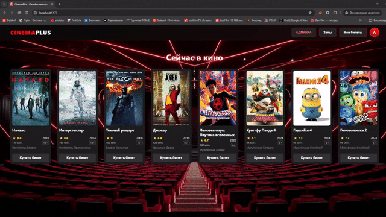
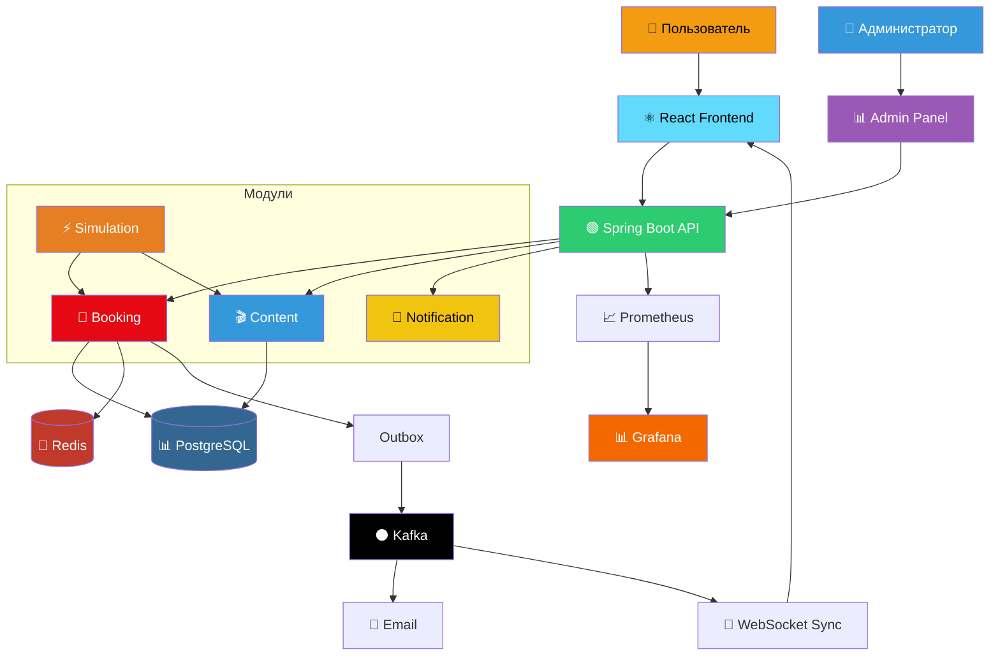
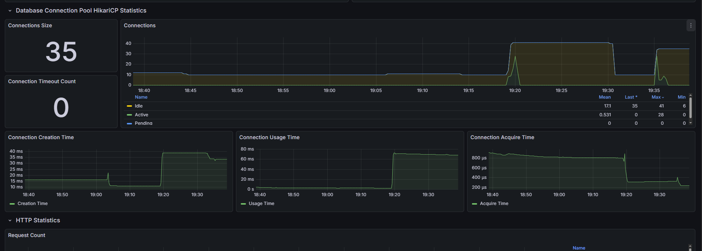
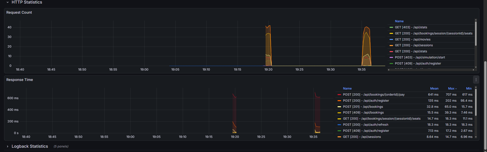
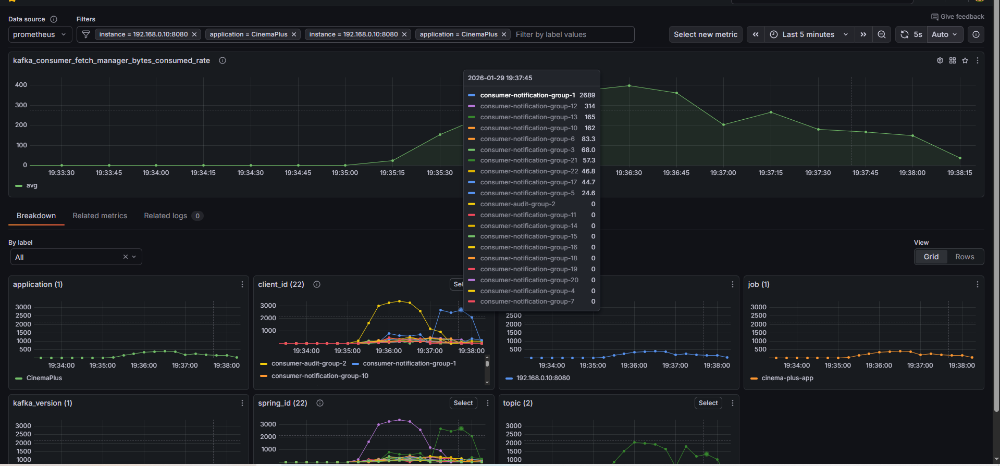
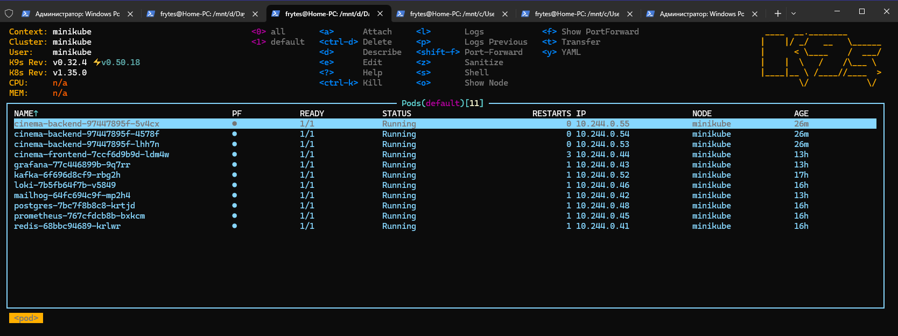
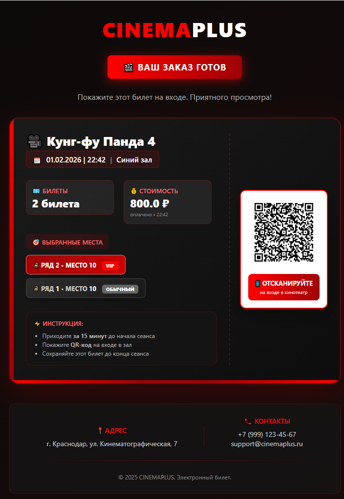

# 🎬 CinemaPlus — Enterprise High-Load Ticketing Platform with Real-Time Booking & Observability


**CinemaPlus** — это Enterprise-ready система бронирования билетов, построенная по архитектуре **Modular Monolith**. Проект имитирует работу реального высоконагруженного сервиса с акцентом на надежность транзакций, масштабируемость и наблюдаемость (Observability).

🔗 **Live Demo:** [cinema-plus.ru](http://cinema-plus.ru)


---

**▶️ [Смотреть полное видео на Dzen](https://dzen.ru/video/watch/697fdba971f0967fd909b119)**  
*Показаны: бронирование, админ-панель, WebSocket-синхронизация, Grafana*

## 🏛️ Архитектура и Ключевые Решения

Проект спроектирован не как простой CRUD, а как сложная распределенная система, способная выдерживать конкурентную нагрузку. При разработке соблюдались методология **12-Factor App** (Stateless архитектура, конфигурация через ENV, паритет dev/prod окружений) и принципы **SOLID**.

### Архитектурная схема

### 1. Modular Monolith & Clean Architecture
Приложение разделено на независимые модули (`booking`, `content`, `notification`, `users`), что позволяет в будущем легко выносить их в микросервисы.
*   **ArchUnit Tests:** Автоматический контроль архитектуры. Тесты падают, если нарушаются границы модулей (например, Контроллер лезет в чужой Репозиторий).
*   **DTO Projection:** Сущности БД никогда не покидают слой сервисов.

### 2. Надежность данных (Data Consistency)
*   **Transactional Outbox Pattern:** Для гарантии доставки событий в Kafka используется таблица `outbox_events`. Событие "Оплата прошла" сохраняется в БД в той же транзакции, что и обновление статуса заказа. Отдельный `@Scheduled` процесс надежно отправляет их в брокер.
*   **Defense in Depth (Тройная валидация):**
    1.  **Frontend:** Блокировка занятых мест в UI.
    2.  **Backend:** Проверка бизнес-правил и статусов.
    3.  **Database:** `Pessimistic Locking` при бронировании и `UNIQUE Constraints` как последняя линия обороны от овербукинга.

### 3. Real-Time & Scaling (WebSockets)
Реализовано обновление схемы зала в реальном времени.
*   Если пользователь А выбрал место, пользователь Б сразу видит его как "Занятое".
*   **Масштабируемость:** WebSocket-сообщения синхронизируются между подами в Kubernetes через **Kafka**, что позволяет пользователям, подключенным к разным экземплярам сервиса, видеть одинаковое состояние зала.

### 4. Динамическое ценообразование (Strategy Pattern)
Система скидок реализована через паттерн **Strategy**, что позволяет включать/выключать бизнес-правила (скидка на утренние сеансы, наценка за VIP) **без перезагрузки приложения** и изменения кода, просто меняя флаги в БД через админку.

## 🏗️ Архитектура системы


---

## 🛠️ Технологический Стек

| Категория      | Технологии                                                |
|----------------|-----------------------------------------------------------|
| **Core**       | Java 21, Spring Boot 3.2, Spring Security                 |
| **Data**       | PostgreSQL, Liquibase, Redis (Caching & Locking)          |
| **Messaging**  | Apache Kafka (KRaft mode), Transactional Outbox           |
| **Frontend**   | React, Vite, Axios, StompJS (WebSockets)                  |
| **DevOps**     | Docker Compose, Kubernetes, GitHub Actions                |
| **Monitoring** | Prometheus, Grafana, Loki (PLG Stack)                     |
| **Testing**    | JUnit 5, Testcontainers, ArchUnit, Stress Simulation Tool |

---

## 📸 Демонстрация

### 1. Мониторинг и Нагрузка (Grafana + Stress Test)
В проект встроен **Simulation Service**, который генерирует тысячи ботов. Они регистрируются, ищут сеансы и конкурируют за билеты.
*Скриншоты Grafana под нагрузкой: HikariCP (пул соединений), Response Time и Kafka Throughput.* (3000 ботов)





### 2. Инфраструктура в Kubernetes (K9s)
Проект полностью адаптирован для запуска в K8s. Используются `ConfigMaps`, `Secrets` и `HealthChecks`.



### 3. Уведомления и Билеты
Асинхронная генерация красивых HTML-писем с QR-кодом (эмуляция MailHog).



---

## 🔐 Безопасность (Security)

*   **JWT + Refresh Token:** Реализована безопасная схема с ротацией Refresh токенов. Токены хранятся в БД (с привязкой к устройству/сессии).
*   **Smart Auto-Refresh:** Frontend (Axios Interceptor) автоматически перехватывает 401 ошибку, обновляет токен и повторяет исходный запрос прозрачно для пользователя.

---
## 🧠 Технические проблемы и их решения 

### 1. Data Consistency (Transactional Outbox)
В распределенных системах нельзя просто сохранить заказ в БД и отправить сообщение в Kafka — если БД упадет после отправки или Kafka недоступна, данные разъедутся.
**Решение:** Я использовал паттерн **Transactional Outbox**.
1. Событие сохраняется в таблицу `outbox_events` в той же транзакции, что и `orders`.
2. Планировщик (`OutboxScheduler`) вычитывает события и отправляет их в Kafka.
   Это гарантирует **At-Least-Once** доставку уведомлений и синхронизацию WebSocket.

### 2. Concurrency Control (Distributed Locks)
Бронирование билетов — критическая секция.
**Проблема:** `Pessimistic Lock` в PostgreSQL хорошо работает, но держит соединение с БД.
**Решение:**
1. **Redis Lock:** При выборе места сначала ставится быстрый лок в Redis (`BookingLockService`). Это снимает нагрузку с БД при наплыве ботов.
2. **DB Constraint:** Уникальный индекс в БД (`uniqueConstraints`) служит последней линией обороны от овербукинга.

### 3. High-Load Simulation (Virtual Threads)
Для стресс-тестирования я написал `SimulationService`, использующий **Java 21 Virtual Threads**.
Это позволяет запускать **3000+** легковесных потоков-ботов на одном инстансе приложения, создавая реальную конкурентную нагрузку (Race Conditions) для проверки надежности блокировок.

### 4. Real-Time Scaling (WebSockets + Kafka)
Обычные WebSocket реализации работают только в пределах одного сервера. Если пользователь А подключен к Серверу-1, а пользователь Б к Серверу-2, они не увидят действия друг друга.
**Решение:**
Реализована синхронизация состояний через **Kafka Pub/Sub**.
1. Когда место блокируется на одном инстансе, событие летит в топик `seat-updates-topic`.
2. Все реплики бэкенда вычитывают это событие и пушат его своим подключенным клиентам через WebSocket.
3. Это позволяет горизонтально масштабировать бэкенд до любого количества подов без потери Real-Time функционала.

## 🚀 Запуск проекта

### Локально (Docker Compose)
Самый простой способ поднять всё окружение (БД, Кафка, Бэкенд, Фронт, Мониторинг)

# 1. Сборка и запуск
```bash
git clone https://github.com/Frytes/CinemaPlus
cd CinemaPlus
APP_PROFILE=dev docker compose --profile full up -d --build
```

Приложение предустанавливает демо-данные при запуске.(Фильмы, сеансы, админ пользователь)

Доступ в админку: admin | admin

# 2. Доступ к сервисам:

* Frontend: # http://localhost:80
* Grafana: # http://localhost:3000 (admin/admin)
* MailHog: #http://localhost:8025
* API Documentation (Swagger UI): http://localhost:8080/swagger-ui/index.html

## ‍💻 Автор
**Антон Рубель** — Java Backend Developer
Связь: Anton.Rubel.94@gmail.com | Telegram - **@Frytes94** 